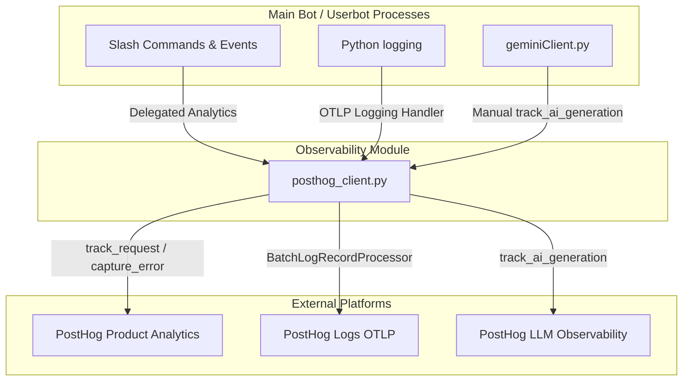

# Observability & Logging Guide 📊🎙️

This guide documents how observability, structured logging, and AI monitoring are designed and integrated into the `VaPls-Discord-Bot` codebase.

---

## 🧠 Architecture Overview

All observability, product analytics, error tracking, and log pipeline logic is centralized in a single-responsibility module: **`posthog_client.py`**.



To maintain **zero disruption to existing code**, the legacy wrapper `analytics.py` remains identical in signature and delegates all internal functions (`capture`, `identify_user`, `capture_exception`, etc.) straight to `posthog_client.py`.

---

## 📡 CLI & OTLP Dual-Logging Pipeline

We maintain a dual-logging pipeline that preserves standard terminal outputs while capturing structured telemetry:

1.  **Terminal Output (CLI):** Standard logs are managed by StreamHandlers configured via `logging.basicConfig(...)` in `bot.py` and `userbot/bot.py`. We **never modify or remove** these stdout streams, so terminal outputs behave exactly as they did before.
2.  **PostHog OTLP Output:** `posthog_client.init_observability()` sets up a standard OpenTelemetry `LoggingHandler` linked to a `BatchLogRecordProcessor`.
    - **Asynchronous Processing:** Logs are batched and exported asynchronously in a background thread. This guarantees **zero execution overhead** or lag on the bot's event loops.
    - **Propagation:** The OpenTelemetry handler is attached directly to Python's root logger. Standard log records naturally propagate up to the root, printing to the terminal via the standard console stream while asynchronously copying to PostHog via OTLP.

---

## 🏷️ Process Separation (`service.name`)

Because the main bot (`bot.py`) and the userbot (`userbot/bot.py`) run as separate processes, a standard OpenTelemetry `Resource` is attached to the log pipeline at startup so you can instantly filter and segment logs in PostHog:

- **Main Bot:** Initializes with `service_name="vapls-main-bot"`.
- **Userbot:** Initializes with `service_name="vapls-userbot"`.

Every OTLP log record shipped to PostHog carries its corresponding `service.name` property.

> **Operational gotcha — two processes, two venvs, two env files.** The main
> bot and the userbot are wired independently:
>
> |          | venv (deps)                                 | env file (`POSTHOG_API_KEY`) |
> | -------- | ------------------------------------------- | ---------------------------- |
> | Main bot | repo-root `requirements.txt` → `./venv`     | repo-root `.env`             |
> | Userbot  | `userbot/requirements.txt` → `userbot/venv` | `userbot/.env`               |
>
> Enabling observability on the userbot requires **both**: the `posthog` /
> `opentelemetry-*` packages in `userbot/requirements.txt` **and**
> `POSTHOG_API_KEY` in `userbot/.env`. Miss either and `init_observability()`
> degrades to a silent no-op (logs `PostHog API key not set` or
> `PostHog package is not installed`).

---

## 🤖 Gemini AI Observability & Token Monitoring

To diagnose token leaks and monitor AI behaviors, the core `generate` function inside `geminiClient.py` is instrumented to capture successful requests.

Because the codebase uses raw HTTP calls (`aiohttp.ClientSession().post`) rather than the official `google-generativeai` SDK, manual instrumentation is performed via `posthog_client.track_ai_generation()`.

### Metrics Captured in PostHog:

- **`$ai_model`:** The specific model used (e.g. `gemini-2.5-flash`).
- **`$ai_latency`:** The precise round-trip API call latency in seconds.
- **`$ai_input_tokens`:** Number of prompt + system instruction tokens.
- **`$ai_output_tokens`:** Number of response tokens generated.
- **`$ai_input`:** Full conversation history structured into prompt list message objects:
  ```json
  [
    { "role": "system", "content": "...system instructions..." },
    { "role": "user", "content": "...previous message..." },
    { "role": "model", "content": "...previous response..." },
    { "role": "user", "content": "...current user prompt..." }
  ]
  ```
- **`$ai_output_choices`:** Concatenated output response generated.
- **`$ai_total_cost_usd`:** Calculated USD pricing for input and output tokens.
- **`guild_id`:** Associated Discord server ID.

This maps directly to PostHog's **LLM Observability** dashboard, allowing you to instantly inspect large prompt payloads and identify where token leakage occurs.

---

## 🛡️ Robustness & Test-Suite Safety

- **No-Op Fail-safe:** If optional SDK packages are absent, or if `POSTHOG_API_KEY` is not present in `.env`, all helpers gracefully degrade into silent no-ops, preserving application startup.
- **Mock Isolation:** Automated unit and integration tests (specifically in `tests/conftest.py`) utilize autouse fixtures that stub out `posthog_client.py` and `analytics.py`, keeping the test suite completely isolated from real networks.

---

## 🔑 Key & Project Reference

| Field                | Value                                                  |
| -------------------- | ------------------------------------------------------ |
| **PostHog Project**  | VaPls Discord Bot — Observability & Analytics          |
| **Host**             | `https://us.i.posthog.com`                             |
| **Personal API Key** | `phx_REDACTED` |
| **Env Var**          | `POSTHOG_API_KEY` in both `.env` and `userbot/.env`    |

> The personal API key (`phx_`) has full project access — keep it out of git.
> It is documented in `PH_API_KEY.md` at the repo root for developer reference.
